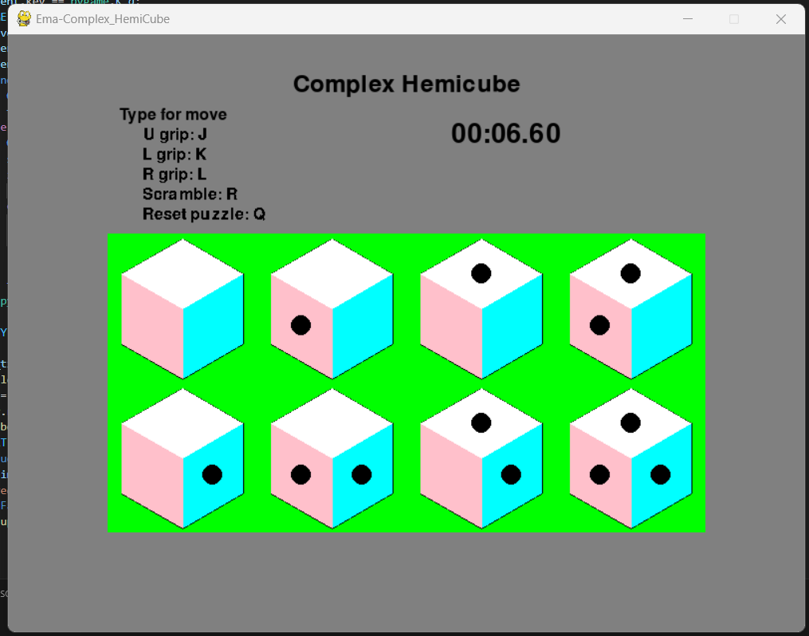

# Complex Hemicube 
#### (hopefully)

## Introduction
In trying to deeply undestand [Grip Theory](https://hypercubing.xyz/theory/grip_theory/), particularly for [Complex Puzzles](https://sonicpineapple.github.io/Complex-Puzzles/Complex.html),
I was wondering about lowering the number of grips, therefore reducing the number of pieces.  
The idea that crossed my mind was to try with a [Hemicube](https://en.wikipedia.org/wiki/Hemicube_(geometry)), a projective polyhedron with 3 faces.  
The code is in no way elegant, but it works.

## Commands
The keys "J", "K", "L" correspond to U, L and R grip respectively (clockwise and anti-clockwise turns are indistinguishable).  
Press "R" to scramble the puzzle and "Q" to reset the puzzle.

## Notes
It's pretty easy to find 1 or 2 move scrambles, I didn't remove them.

## How to play
Download script and open with Python.  
Prerequisite packages are itertools, pygame, sys, math and random.

